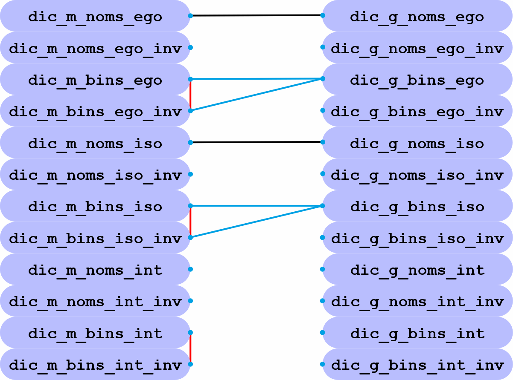

# Commentaires généraux
#### Remarques importantes
    Approfondir la compréhension des cumulations binaires des modes
    On ne peut choisir qu'une seule conversion sur quatre[int, bin, hex, oct].
#### Remarques historiques
    L'application dans sa création a pris un tournant, du fait que composée de fonctions, elle a changé en classe.
## Quelle utilité pour cette application
    Nous avons les boutons de la colonne des nombres entiers, et ceux de la barre horizontale des noms des gammes.

### Les boutons verticaux des binaires
    Nous pouvons avoir des méthodes de lecture :
    La méthode de lire à partir du bouton vertical, les gammes qui utilisent ce bouton (mono-note ou accord).
Par défaut les gammes qui ont ce mode binaire dans leurs corps diatoniques, seront lues de haut en bas  
et de gauche à droite. La lecture respectera l'ordre des degrés ainsi que l'ascension des octaves.  

1. [ ] Position du bouton-radio statique : 
   1. Par défaut la gamme sélectionnée sera en DO (tout comme toutes les gammes qui ont été développées en DO).

2. [ ] Position du bouton-radio dynamique : 
   1. Cette première gamme sert de référence à la mise en tonalité de la gamme suivante, la nouvelle tonalité   
   dépendra des occurrences entre ces deux gammes voisines, ici, les lignes représentent les hauteurs tonales.

**On peut créer plusieurs genres de lecture.**
* Lecture des gammes ayant ce modèle binaire.
  * Cette lecture suit l'ordre affiché, le changement de gamme se fera en respectant la concordance de la tonalité.
  * Il y a plusieurs choix concernant les sens de lectures :
    * De haut en bas, de bas en haut, du binaire en accord haut et bas, en suivant l'ordre des degrés.
    * En ne lisant que la ligne du binaire sélectionné, la ligne en accord,

### Les boutons horizontaux des gammes
    Nous pouvons avoir des méthodes de lecture :
    Tout comme les boutons verticaux, les boutons horizontaux peuvent lire les gammes qui ont les mêmes propriétés.
1. [ ] Position du bouton-radio statique : 
   1. Par défaut la gamme sélectionnée sera en DO (tout comme toutes les gammes qui ont été développées en DO).

2. [ ] Position du bouton-radio dynamique : 
   1. Cette première gamme sert de référence à la mise en tonalité de la gamme suivante, la nouvelle tonalité   
   dépendra des occurrences entre ces deux gammes voisines, ici, les lignes représentent les hauteurs tonales.

**On peut créer plusieurs genres de lecture.**
* La lecture de la gamme peut se faire de façon unique ou en accord.
  * Il y a plusieurs choix concernant les sens de lectures :
    * La gamme de bas en haut, de haut en bas, en suivant les degrés.
    * On peut aussi lire les gammes qui ont des correspondances binaires. De droite à gauche ou l'inverse, en accord.

#### Types de méthodes sur les gammes : Lorsqu'on appuie sur un bouton vertical ou horizontal.
* La gamme a en commun six notes avec la gamme suivante, la tonique est la même.
* La gamme n'a pas de lien avec la suivante, la tonique devient en DO.
* La gamme a un lien avec la suivante, la tonique devient celle de la gamme suivante.
* La gamme a plusieurs liens avec la suivante, la tonique devient celle qui a le plus de notes communes.

### Boutons radios ajoutés
    Couper le son du mode lecture
 

    Choix de la polarité du traitement
Le pôle "Modes" exécute le tri classique réalisé sur les modes binarisés des gammes.  
Le pôle "Gammes" exécute le tri sur les formes énumérées des gammes (modes toniques).  
Le pôle "Contient" exécute une transition des formes énumérées en des quantités d'intervalles.  

**Constitution des polarités.**
  

Aux premiers pas de cette application, seuls les degrés modaux étaient traités. Ce qui nous donnait six résultats  
et maintenant, les gammes sous leurs formes énumérées sont traitées et elles apportent leur lot de nouveautés.  
Ce n'est plus seulement six, mais douze éléments configurant douze listes particulières.

Ce nouveau traitement nous entraine à l'analyse des différentes listes.  
Les listes[_iso0 et _iso1] changent selon le choix[Modes ou Gammes ou Contient]. `self.zone_w4.get()`
*  [EGO] = Organisation composée à partir de la gamme naturelle......... `self.gam_ego`
   *  La fonction `def gamme.arp(self)` produit les gammes à partir de la gamme majeure.
   * Elle est effective lors de l'appui sur les images _[modes[Tri_ego] et gammes[Tri_ego]]_.
*  [ISO] = Organisation composée à partir du fichier `globdicTcoup.txt`. `self.gam_iso`
   * La fonction `def gamme_log(self)` organise les gammes à partir du fichier `globdicTcoup.txt`.
   * **Rappel** : Contient les formes énumérées de la globalité des modulations diatoniques.
     * Cette séquence a été automatiquement établie dans un précédent algorithme basé sur les tétracordes.
   * Elle est effective lors de l'appui sur les images _[modes[Tri_iso] et gammes[Tri_iso]]_.
*  [INT] = Organisation croissante des éléments......................... `self.gam_int`
   * Les valeurs des éléments gammiques peuvent être ordonnés en croissance.
   * Ces valeurs proviennent de la liste [ISO], qui d'ailleurs, elles sont identiques à celles-ci [EGO] et [INT].
      * Les valeurs correspondent aux modes diatoniques qui ne varient jamais ici.

Nous avons finalement trois types de traitement `("Modes" ou "Gammes" ou "Contient")`.  
Chacun d'eux a deux catégories, les noms des gammes énumérées et leurs modes binarisés.  

Je rappelle que nous travaillons sur les soixante-six gammes primordiales et fondamentales, une gamme a sept notes diatoniques.

Dictionnaire des listes :  
La liste des noms {`dic_noms_ego`, `dic_noms_ego_inv`, `dic_noms_iso`, `dic_noms_iso_inv`, `dic_noms_int`, `dic_noms_int_inv`}  
Celle des modes {`dic_bins_ego`, `dic_bins_ego_inv`, `dic_bins_iso`, `dic_bins_iso_inv`, `dic_bins_int`, `dic_bins_int_inv`}  
Chaque liste change en raison de son originale polarité `("Modes" ou "Gammes")`, ce qui donnera {`dic_m_bins_ego` ou `dic_g_bins_ego`}  

La figure "constitutions polaires" comprend plusieurs égalités liées aux traitements.

_**TRAITS NOIRS**_ `dic_m_noms_ego` = `dic_g_noms_ego`. Puisque tous les deux sont issus de `def gammes.arp(self)`.  
_**TRAITS BLEUS**_ `dic_m_bins_ego` = `dic_g_bins_ego`. Même ordre binarisé constaté.  
_**TRAITS ROUGES**_ `dic_m_bins_ego` = `dic_m_bins_ego_inv`. L'ordre a seulement été inversé.  
Les égalités baissent le nombre des différences, on sait que pour un [ISO], nous avons deux listes[noms, modes].  

    En comptant uniquement les différences, on obtient dix-sept marquages de modulations.
______________________________________________________________________________________________________________
#### La fonction clic_image
    La liste selon '(self.dic_binary.keys())'.
    La liste selon 'self.colonne_bin.copy()'.
## Méthodes du traitement des modes binaires
_Il existe une seule constance au démarrage, ce sont les modes naturels binaires._ 
_Les modes binaires sont issus du type classique des gammes primordiales, le type physique n’a pas encore été vu._ 
_'songammes' : Construit les gammes et les binaires selon le type classique = Dictionnaire alimenté par le fichier_ 
_'globdicTcoup.txt' : Une création des 462 formules numériques, exemple = '102034050607'._ 
### La méthode par défaut
    Elle initialise les sept premières lignes de la colonne des modes binarisés.
    Ensuite, elle fait un sondage sur les formes binarisées restantes et à venir,
    pour définir quelle forme contient le plus de modes 'binaires' présents grâce aux modes déjà traités.
* Tel qu'il a été écrit à son départ, le traitement est en mode 'append()' 
C’est ainsi, que grâce aux gammes fondamentales, la colonne des binaires a été remplie.
#### La méthode des entiers (Nombres entiers)
    La liste originale des binaires a un ordre donné par **la méthode par défaut**.
    En transformant le tri en ordre croissant remplace la séquence originale.
    En inversant l'ordre croissant trié, on opère sur le tempérament original.
##### Le bouton ego et le bouton iso.
* Ego est produit lors du traitement de l'application.
* Iso est produit à la préparation des données binaires.
##### Le bouton ego et le bouton iso, inversés.
##### Les boutons int, l'un est ordonné et l'autre est inversé.
* Int = Les données binaires ont été triées en ordre croissant et inversement.
_______________________________________________________________________________
### Les réglages

Choisir la tonalité, le signe, les durées des notes et des silences. 
* Menus déroulants. 
* Par défaut, la tonalité est en DO[C].

Régler le volume.
* Curseur. 

Accès sur les accords typiques.
*   Radios-boutons dans une fenêtre contextuelle. 

### Les lectures

Types : De bas en haut, de haut en bas, de gauche à droite, de droite à gauche.  
Du niveau de la sélection, puis vers la gauche et la droite, l'accord est possible.  
Une lecture au niveau de la sélection (binaire ou gamme).
* Ne lire que la ligne (binaire, gamme).
* Lire les gammes au même binaire.
* Lire les gammes aux mêmes degrés (binaires, gammes).
* Lire à partir de la sélection (binaires, gammes).

La lecture respecte l'ordre donné par les degrés,  
avec la possibilité d'enregistrer et de mémoriser (gammes, accords).
* Bouton d'enregistrement.
* Bouton de mémorisation.

 
 
 
 
 

